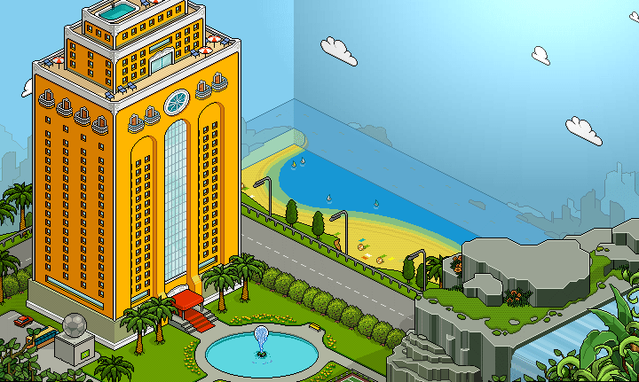

# How to change hotel view

In order to edit the hotel view all you need to do is open up the `external_variables.txt` file and find existing entry. 

E.g: 
```
...
cast.entry.1=hh_interface
cast.entry.2=hh_patch_uk   <----------
cast.entry.3=hh_people_1
...
cast.entry.16=hh_entry_au   <----------
...
```

Then you change that `cast.entry` to some other `hh_entry` and `hh_patch` file instead. 
Below are a list of official hotel views and their corresponding file name.

In our example replacing `hh_entry_uk` with `hh_entry_au` will change the hotel view to Australian. 

It's important to change both the `hh_entry` and `hh_patch` file as `hh_patch` contains literal patches to assets. 
E.g. Changing `hh_patch_uk` to `hh_patch_dk` will replace the catalogue images to danish. 

## Australia
Filename: `hh_entry_au.cct`


## Brazilian
Filename: `hh_entry_br.cct`


## Canada 
Filename: `hh_entry_ca.cct`


## Chinese
Filename: `hh_entry_ch.cct`


## German
Filename: `hh_entry_de.cct`


## Danish
Filename: `hh_entry_dk.cct`


## Spanish
Filename: `hh_entry_es.cct`


## Finnish
Filename: `hh_entry_fi.cct`


## France
Filename: `hh_entry_fr.cct`


## Italian
Filename: `hh_entry_it.cct`


## Japanese
Filename: `hh_entry_jp.cct`

When using this hotel view it gives you the option to customize the image scrolling across the building. 

E.g. in the image below it shows: image with the snowflakes and the text "Welcome to Habbo Hotel".

The image is controlled by the `entry.scroll.desc` variable which links to a file e.g. [scrollerTextData.txt](../assets/images/hotel_views/scrollerTextData.txt) and then the image is a simple gif.


Extra variables that can be added to `external_variables`: 

`entry.scroll.frms`

`entry.scroll.desc`


## Netherland
Filename: `hh_entry_nl.cct`


## Norway
Filename: `hh_entry_no.cct`


## Russian
Filename: `hh_entry_ru.cct`


## Swedish 
Filename: `hh_entry_se.cct`


## Singapore
Filename: `hh_entry_sg.cct`


## United States
Filename: `hh_entry_us.cct`


## United Kingdom
Filename: `hh_entry_uk.cct`

