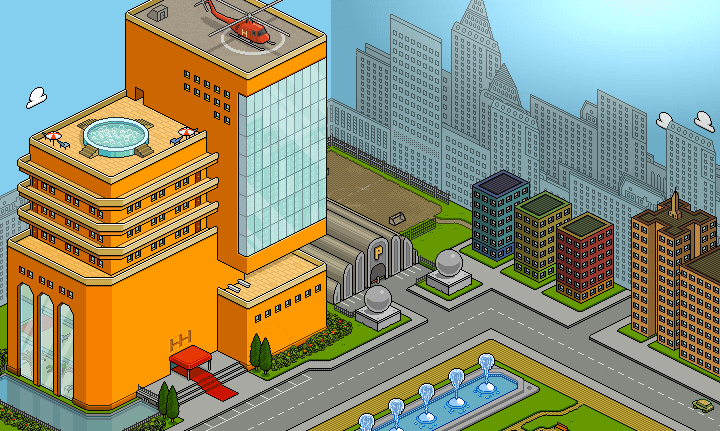
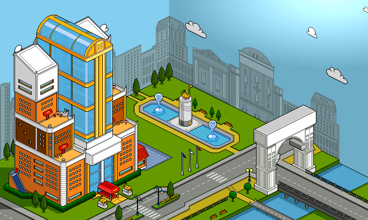
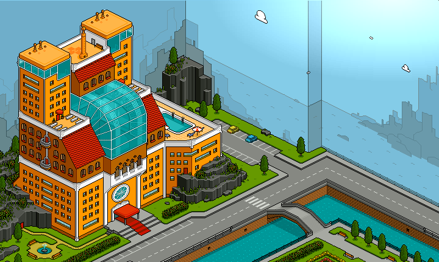
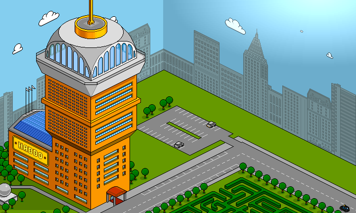

# How to change hotel view

TBA

## Japanese hotel View
Filename: `hh_entry_jp.cct`

When using this hotel view it gives you the option to customize the text scrolling across the building as well as the image overlapping the text. 

E.g. in the image below it shows: the snowflakes as an overlaying image and "Welcome to Habbo Hotel" was the description. 

Extra variables: 

`entry.scroll.frms` (Image)
`entry.scroll.desc` (Text)

